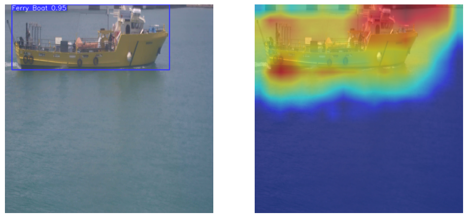
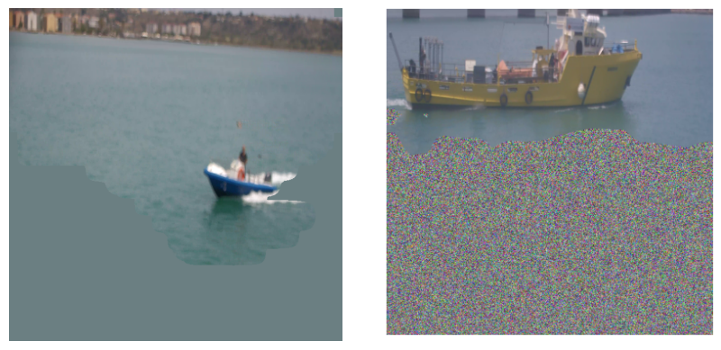

# EXPLAINABLE AI FOR YOLO OBJECT DETECTORS

This repo contains scripts to get and evaluate explanation from YOLOv8 models using EigenCAM framework.
For this application models trained to detect boats have been used, but the process is scalable and extendable to other case-studies.

## Metrics
Metrics used to evaluate the quality of the explanations and the model's performances are AOPC and HAAS. These metrics evaluate the performances of the model as classifier, but also IoU is tested in with the purpose of evaluating also the localization performances of the model taken into account.

## Process

This script performs 3 kind of perturbation on the images in the [dataset](utils/dataset/subset) folder: mean and random perturbation are performed to compute and evaluate AOPC, whereas to compute HAAS least relevant pixels in the saliency map are removed.

### Perturbation

First the heatmap is obtained using EigenCAM, then the grayscale version is used to substitute the least relevant pixels with the mean of the value of pixels in the image or with a random distribution






This process is repeated for different percentiles of least relevant pixels selected, that goes from 0 to 100%.


# Description Perturbation Script

Perturbation of a set of images using YoloV8 models to store confidence and IoU data.
Perturbation modes can be selected as Remove, Random or Mean.
Also two models can be selected (IR and Visible).
# Usage:


```bash
usage: perturb.py [-h] [-d D] [-m M] [-l L] [-lc] [-p P] [-v] [-c C]

```
# Arguments

|short|long|default|help|
| :--- | :--- | :--- | :--- |
|`-h`|`--help`||show this help message and exit|
|`-D`||`utils/dataset/subset/`|Relative path to the directory containing images.|
|`-M`||`models/`|Relative path to the directory containing models|
|`-L`||`-2`|Select the target layer.|
|`-LC`|||Show layer check|
|`-P`||`0`|Select perturbation (Remove, Random, Mean).|
|`-V`|||Select double model (IR and Visible or not)|
|`-C`||`7`|Select the specific class (default All).|


# Description Computation Script

Computation for Explainable AI using YOLOv8 models, this script shows plots for IoU, confidence score over different perturbation percentiles and initial confidence score and then saves the outputs to a cvs.

# Usage:


```bash
usage: compute.py [-h] [-d D] [-t T] [-c C] [-f] [-s]

```
# Arguments

|short|long|default|help|
| :--- | :--- | :--- | :--- |
|`-h`|`--help`||show this help message and exit|
|`-D`||`dati/trained_model/`|Relative path to the directory containing .pkl files.|
|`-T`||`0`|Select confidence (0), iou (1) or initial confidence (2).|
|`-C`||`7`|Select the specific class (default ALL).|
|`-F`|||Print confidence and iou on csv|
|`-S`|||Set confidence and iou or confidence only (Single Class)|


